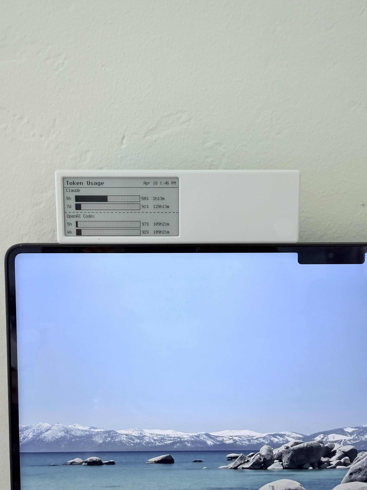

# token-usage-dash

Pushes Claude and OpenAI Codex subscription plan usage to a [dot.mindreset.tech](https://dot.mindreset.tech) e-ink display as a 296×152 image.



## What it shows

- **Claude** — 5-hour and 7-day utilization (% used, % left, time to reset)
- **OpenAI Codex** — 5-hour and weekly utilization

## Setup

### 1. Install dependencies

```bash
uv sync
playwright install chromium
```

### 2. Configure

```bash
cp .env.sample .env
```

Edit `.env` with your credentials:

| Key | Description |
|-----|-------------|
| `QUOTE_API_KEY` | Bearer token from dot.mindreset.tech |
| `QUOTE_DEVICE_ID` | Device serial number |
| `OPENAI_ENABLED` | Set to `false` to skip OpenAI scraping (default: `true`) |
| `UPDATE_INTERVAL` | Seconds between updates in loop mode (default: `1800`) |

### 3. Claude auth

Claude credentials are read automatically from `~/.claude/.credentials.json` (created when you authenticate with [Claude Code](https://claude.ai/code)).

### 4. OpenAI Codex auth

OpenAI has no public usage API — the script scrapes `chatgpt.com/codex/cloud/settings/analytics` using your browser session cookies. To set them up:

1. Log into [chatgpt.com](https://chatgpt.com) in your browser
2. Open DevTools → Network → click any request → copy the `Cookie:` header value
3. Save it:
   ```bash
   uv run usage.py --save-openai-cookies "paste-cookie-header-here"
   ```

Cookies are saved to `~/.config/token-usage-dash/openai-cookies.json` and will need refreshing every few days when they expire.

### 5. Add Image API content in Content Studio

In the dot.mindreset.tech app, add an **Image API** content slot to your device. The script targets this slot.

## Usage

```bash
# One-shot update
uv run display.py

# Loop every 30 minutes
uv run display.py --loop

# Loop with custom interval and save preview PNG
uv run display.py --loop --interval 900 --preview

# Preview image without pushing to device
uv run render.py   # saves to /tmp/usage_preview.png

# Print usage to terminal only
uv run usage.py
uv run usage.py --claude-only
uv run usage.py --openai-only
```

## Files

| File | Purpose |
|------|---------|
| `usage.py` | Fetches Claude and OpenAI usage data |
| `render.py` | Renders the 296×152 PNG image |
| `display.py` | Orchestrates fetch → render → push to device |
